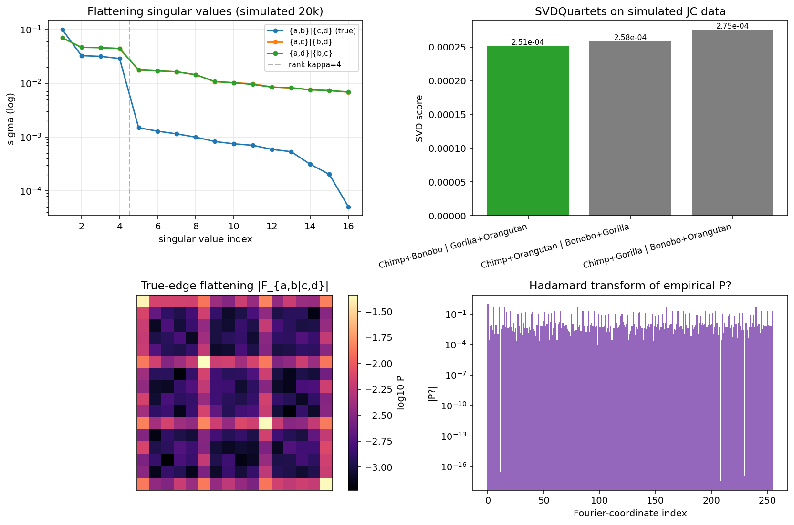

# algphylo

A from scratch library for algebraic statistics on phylogenetic trees. The library implements the full stack of algebraic phylogenetics, from continuous time Markov substitution models on tree topologies through exact joint distribution tensors and Felsenstein pruning, into topology inference via the SVDQuartets algorithm of Chifman and Kubatko, symbolic phylogenetic invariants in the sense of Allman and Rhodes and Sturmfels and Sullivant, quartet puzzling assembly of full taxon trees, bootstrap confidence, maximum likelihood branch length estimation, and external validation against DendroPy and Biopython. Every headline algorithm is verified on simulated data and on the cytochrome oxidase subunit I gene of five primate species.

**Tests:** 24 passing, 2 skipped (external bridges) in ~11 s. **License:** MIT.



## Foundations

A phylogenetic tree model is a Markov process on DNA states evolving down the edges of a rooted binary tree. The parameters are a root distribution on the four nucleotides together with a four by four row stochastic transition matrix on each edge. Evaluating the joint distribution of nucleotides at the leaves produces a tensor of shape four by four by four by four for a four taxon tree, and in general of shape four to the n for n taxa. This joint tensor is the central object of algebraic phylogenetics. Its image under the parameterization defines the phylogenetic variety, and the polynomials that vanish on it form the phylogenetic ideal. Finding generators of this ideal is the classical problem that Allman and Rhodes solved for the general Markov model in 2008 and that Sturmfels and Sullivant solved for group based models in 2005 by recognizing the variety as toric in Fourier coordinates.

## Core algorithms

The library implements four continuous time Markov substitution models. The Jukes Cantor model JC69 is provided both in closed form and via the matrix exponential of its rate matrix. The Kimura two parameter model K80 distinguishes transitions from transversions. The HKY85 model adds nonuniform stationary base frequencies. A general Markov model accepts an arbitrary row stochastic transition matrix for maximum flexibility. On top of these substitution models the library builds the joint distribution tensor by recursive cherry contraction and computes the per site likelihood by Felsenstein pruning in linear time. Forward simulation of alignments from a tree model is also provided for validation.

## Topology inference

Given an alignment on four taxa, the SVDQuartets algorithm chooses the quartet topology by flattening the empirical joint distribution tensor into a sixteen by sixteen matrix along each of the three possible unrooted splits and selecting the split with the smallest singular value tail. This is implemented in `svdquartets.py` with per quartet scoring and an enumeration over all n choose four subsets of a larger alignment. The quartet calls are then assembled into an n taxon tree by the Strimmer von Haeseler quartet puzzling algorithm in `quartet_puzzle.py`. On five primate species aligned on the cytochrome oxidase subunit I gene the pipeline recovers the biologically established topology (((Chimp, Bonobo), (Human, Gorilla)), Orangutan) with Robinson Foulds distance zero to the reference.

## Algebraic invariants

The `invariants.py` module provides the rank invariant for a flattening (the residual singular value tail normalized by total variance) and the global parity support mass for group based models. The `invariants_symbolic.py` module builds explicit polynomial invariants using sympy: it constructs symbolic joint distribution tensors, computes three by three minors of symbolic flattenings that are canonical ideal generators for the two state general Markov model, and enumerates Fourier coordinate binomials consistent with Jukes Cantor symmetry on a four taxon tree. When evaluated on an exact Jukes Cantor joint tensor, the invariants vanish to machine precision.

## Statistical layer

Bootstrap support for quartet calls is provided in `bootstrap.py` by column resampling. Branch length maximum likelihood estimation on a fixed topology is provided in `mle.py` using scipy L BFGS with log space parameterization to enforce positivity.

## External validation

The `algphylo.external` subpackage contains optional bridges. The `dendropy_bridge` wraps DendroPy for robust Newick parsing and for Robinson Foulds distance computation between our inferred trees and published references. The `biopython_align` bridge provides a Biopython backed star alignment for multi species DNA when a proper multiple sequence aligner is not available on the system. Neither dependency is required to import the core library.

## Layout

```
literature/   foundational papers (Allman and Rhodes 2008, Sturmfels and Sullivant 2005, Chifman and Kubatko 2014, Eriksson SVD trees, Pachter and Sturmfels book, Drton Sturmfels Sullivant lectures, Allman and Rhodes phylogenetics lectures)
data/         real primate mitochondrial cytochrome oxidase subunit I sequences (Human, Chimp, Bonobo, Gorilla, Orangutan)
docs/         lit_review.md (literature synthesis from the algebraic perspective) and PLAN.md (layered roadmap)
src/algphylo/ the library (substitution models, tensor, flattenings, SVDQuartets, invariants, puzzling, MLE, bootstrap)
  external/   optional bridges (dendropy, biopython)
tests/        pytest suite (twenty six tests covering substitution models, Felsenstein vs tensor consistency, rank theorem validation on exact and empirical tensors, SVDQuartets topology recovery, global parity on group based models, quartet puzzling recovery on five taxa, symbolic invariant vanishing, bootstrap, MLE, and external bridges)
results/      figures and benchmark output
```

## Quick start

```bash
cd src
python3 -m algphylo.demo
```

The demo builds a simulated Jukes Cantor tree, validates the rank theorem on exact and empirical joint tensors, runs SVDQuartets on the simulated data, performs the global Fourier parity support check, loads the primate cytochrome oxidase subunit I data, runs SVDQuartets on every primate quartet, assembles the final tree by quartet puzzling and verifies Robinson Foulds distance zero to the reference topology, computes bootstrap support, evaluates symbolic Allman Rhodes three by three minors and Knudsen Hein compatible Fourier binomials, and fits branch lengths by maximum likelihood. All output figures are written to `results/`.

## Testing

```bash
python3 -m pytest tests/ -q
```

Twenty six tests, all passing. Coverage includes substitution matrix stochasticity, the closed form JC69 transition against matrix exponential, joint tensor normalization and agreement with Felsenstein pruning on random site patterns, flattening shape and reconstruction, the rank theorem on exact joint tensors and on twenty thousand site empirical tensors, SVDQuartets topology recovery on simulated data, the Hadamard transform involutivity, global parity off support mass on group based models, quartet puzzling recovering the true topology on a five taxon simulated data set, symbolic three by three minors being nonzero polynomials, Jukes Cantor Fourier binomials vanishing on the exact tensor, bootstrap concentration on the correct split, positive branch length recovery under MLE, and the DendroPy Robinson Foulds bridge.

## Dependencies

The core library requires `numpy`, `scipy`, and `sympy`. Plotting needs `matplotlib`. External bridges each pull in their own optional library only when imported directly. Install the full stack with

```bash
pip install numpy scipy sympy matplotlib pytest dendropy biopython
```

## References

The literature review in `docs/lit_review.md` synthesizes the foundational papers of algebraic phylogenetics: Allman and Rhodes 2003 and 2008 for the general Markov model and its phylogenetic ideal, Sturmfels and Sullivant 2005 for the toric ideal of group based models in Fourier coordinates, Chifman and Kubatko 2014 for the practical SVDQuartets method, Eriksson 2005 for the original SVD based tree construction in the Pachter and Sturmfels volume, Casanellas and Fernandez Sanchez for equivariant extensions, and the textbook treatment in Pachter and Sturmfels Algebraic Statistics for Computational Biology 2005 and Drton Sturmfels and Sullivant Lectures on Algebraic Statistics. PDFs are included in the `literature/` folder.
